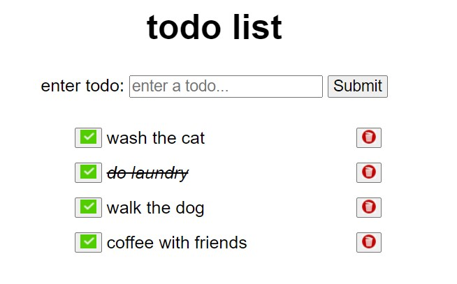

# A todo application

The application allows entry of tasks that to be done - a 'todo'! The tasks are displayed in a list beneath the entry form. Also provided are the options to either complete
each todo item or to remove it from the page. Empty todo's are not accepted and very long todo descriptions are not recommended.

## Screenshots

## Features

- enter unlimited number of tasks
- cross-off each task 
- remove task from screen
- resets to allow rapid additon of tasks
- alerts if empty task entered 

## 🛠 Skills
Javascript, HTML, CSS

## Lessons Learned
- JS arrays, event listeners 
- JS ternary and arrow functions
- DOM interaction/ control 
- JS array filtering 
- HTML forms manipulation
- Use of browser to debug 

## Author

- [@davidtcliffe](https://github.com/davidcliffe)
